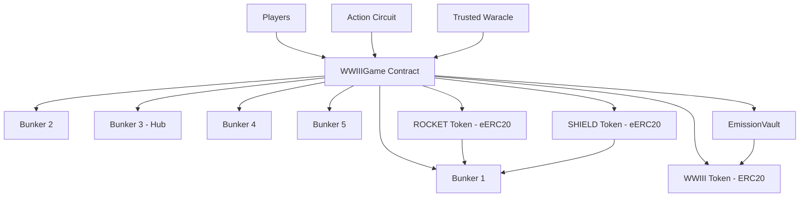

# WWIIInu - Privacy-Preserving Blockchain Strategy Game

## Overview

WWIIInu is an experimental blockchain-based strategy game built on top of the [EncryptedERC](https://github.com/ava-labs/EncryptedERC) protocol. This project demonstrates how zero-knowledge proofs and homomorphic encryption can enable complex game mechanics while preserving strategic privacy through "fog of war" dynamics.

**⚠️ EXPERIMENTAL SOFTWARE**: This project was created with assistance from Claude AI and should be considered experimental. The smart contracts have not been audited and are intended for educational and demonstration purposes only.

## Table of Contents

- [Architecture Overview](#architecture-overview)
- [Key Features](#key-features)
- [Game Mechanics](#game-mechanics)
- [Technical Implementation](#technical-implementation)
- [Files Added to EncryptedERC](#files-added-to-encryptederc)
- [Development Process](#development-process)
- [Security Considerations](#security-considerations)
- [Deployment](#deployment)
- [Testing](#testing)
- [Future Development](#future-development)

## Architecture Overview

WWIIInu extends the EncryptedERC protocol to create a multi-player strategy game where:

- **Players** deploy WWIII tokens to bunkers across a battlefield
- **Actions** (attacks/defenses) are validated using zero-knowledge proofs
- **Combat resources** (ROCKET/SHIELD tokens) remain encrypted until round resolution
- **Strategic information** is hidden from opponents while maintaining game integrity
- **Economic incentives** drive gameplay through emission-based rewards

### Core Components



## Key Features

### 🔐 Privacy-Preserving Gameplay
- **Fog of War**: Attack targets visible, but resource allocations encrypted
- **Zero-Knowledge Proofs**: Actions validated without revealing strategic information
- **Homomorphic Encryption**: Combat calculations on encrypted values

### ⚔️ Strategic Combat System
- **5 Bunkers**: Connected battlefield with central hub (Bunker 3)
- **ROCKET/SHIELD Tokens**: Encrypted combat resources
- **Damage Resolution**: Net damage calculation with bunker destruction
- **Index System**: Proportional ownership tracking with precision handling

### 💰 Economic Game Theory
- **WWIII Token**: Core game currency with 10B fixed supply
- **Emission System**: 6B tokens distributed over 3+ years (flexible schedule)
- **Bunker Advantage**: Bunker 3 receives 2x emissions as strategic hub
- **Player Incentives**: Risk/reward mechanics driving strategic decisions

### 🎮 Complete Game Lifecycle
- **Deployment Phase**: 2-day setup period for player positioning
- **Active Rounds**: 8-hour combat cycles with real-time actions
- **Round Resolution**: Waracle-mediated combat calculation and resource distribution
- **Emergency Systems**: 24-hour timeout protection and game halt mechanisms

## Game Mechanics

### Player Actions

1. **Deploy**: Place WWIII tokens in a bunker (minimum 10,000 tokens)
2. **Add Tokens**: Increase deployment in current bunker
3. **Move**: Transfer between connected bunkers
4. **Attack/Defend**: Submit zero-knowledge proof for encrypted resource allocation
5. **Retreat**: Withdraw tokens with proportional calculation

### Bunker Network

```
    1 ════ 2
    ║  ╲ ╱ ║
    ║   3  ║
    ║  ╱ ╲ ║
    4 ════ 5
```

- **Bunker 3**: Central hub connecting to all others (receives 2x emissions)
- **Movement Rules**: Players can only move between directly connected bunkers
- **Strategic Positioning**: Location affects movement options and vulnerability

### Combat Resolution

1. **Action Submission**: Players submit encrypted ROCKET/SHIELD allocations
2. **Round End**: 8-hour timer expires, no more actions accepted
3. **Waracle Decryption**: Trusted Waracle decrypts all combat resources
4. **Damage Calculation**: Net damage = ROCKET received - SHIELD received
5. **Index Updates**: Bunker indices adjusted based on damage/destruction
6. **Resource Distribution**: Vault emissions distributed to surviving bunkers
7. **Token Cleanup**: All ROCKET/SHIELD tokens burned for next round

## Technical Implementation

### Smart Contracts Added

#### Core Game Contract
- **`contracts/WWIIIGame.sol`** (1,200+ lines): Main game logic with complete lifecycle management

#### Token Contracts
- **`contracts/tokens/WWIIIToken.sol`**: Fixed-supply ERC20 (10B tokens)
- **`contracts/tokens/WWIIIGameToken.sol`**: Unified eERC20 template for ROCKET/SHIELD

#### Infrastructure Contracts
- **`contracts/Bunker.sol`**: Token vault with max approval pattern
- **`contracts/EmissionVault.sol`**: Holds 6B tokens for game rewards

#### Zero-Knowledge Integration
- **`circom/action.circom`**: ZK circuit for action validation with eERC20 mint proof integration
- **`contracts/verifiers/ActionCircuitGroth16Verifier.sol`**: On-chain proof verification
- **`contracts/interfaces/verifiers/IActionVerifier.sol`**: Verifier interface

### Zero-Knowledge Circuit Design

The action circuit implements sophisticated validation:

```circom
// Server authentication prevents unauthorized proof generation
component serverHashCheck = Poseidon(1);
serverHashCheck.inputs[0] <== serverPrivateKey;
serverHashCheck.out === expectedServerHash;

// Validates complete mint proofs for ROCKET/SHIELD tokens
// Ensures allocation constraints: ≥1 each, total ≤ deployed
// Enforces bunker connection topology
// Outputs 67 public signals for eERC20 compatibility
```

**Circuit Statistics**:
- **Constraints**: ~1,500 (optimized for fast proving)
- **Public Signals**: 67 (server auth + mint proof data + bunker IDs)
- **Security**: Server-only proof generation with Poseidon authentication

### eERC20 Integration Architecture

WWIIInu leverages the EncryptedERC protocol for privacy-preserving token operations:

1. **Game Contract Ownership**: WWIIIGame owns ROCKET/SHIELD tokens for `privateMint` access
2. **Bunker Registration**: Each bunker registered with unique BabyJubJub key pairs
3. **Encrypted Minting**: Combat resources minted as encrypted balances to bunkers
4. **Waracle Decryption**: Off-chain private keys enable balance decryption for combat
5. **Clean Burning**: Complete token cleanup after each round via `burnAllTokensFrom()`

### Index System for Proportional Ownership

A sophisticated index system tracks proportional ownership over time:

```solidity
// Player balance calculation
uint256 currentBalance = (deployedAmount * currentIndex) / depositIndex;

// Damage application to bunker index
uint256 newIndex = (oldIndex * remainingTokens) / 
                   (remainingTokens + damage);
```

## Files Added to EncryptedERC

### Documentation & Planning
```
BUILD_PLAN.md                   - Master implementation plan and progress tracking
IMPLEMENTATION_PLAN.md          - Detailed architecture and design decisions
GAME_TEST_PLAN.md               - Comprehensive test strategy breakdown
CHANGE_EMISSIONS.md             - Flexible emissions system analysis
wwiii-game-design-updated.md    - Original game design document
wwiii-test-plan-updated.md      - Original test requirements
CLAUDE.md                       - Development context and instructions
WWIIInu.md                      - This comprehensive project summary
```

### Smart Contracts Added
```
contracts/WWIIIGame.sol                              - Main game contract
contracts/Bunker.sol                                 - Bunker vault contract
contracts/EmissionVault.sol                         - Token emission management
contracts/tokens/WWIIIToken.sol                     - Game currency (ERC20)
contracts/tokens/WWIIIGameToken.sol                 - Unified ROCKET/SHIELD (eERC20)
contracts/verifiers/ActionCircuitGroth16Verifier.sol - ZK proof verification
contracts/interfaces/verifiers/IActionVerifier.sol   - Verifier interface
contracts/interfaces/IGameEncryptedERC.sol          - Game-specific eERC20 interface
```

### Zero-Knowledge Circuits
```
circom/action.circom                    - Action validation circuit with eERC20 integration
circom/build/action/*                   - Compiled circuit artifacts
zkit/artifacts/circom/action.circom/*   - ZKit generated files
```

### Test Suite (180+ tests across 12 files)
```
test/wwiii-token.test.ts               - WWIII token functionality
test/wwiii-game-token.test.ts          - ROCKET/SHIELD token tests
test/bunker.test.ts                    - Bunker contract tests
test/emission-vault.test.ts            - EmissionVault functionality
test/wwiii-game-core.test.ts           - Core game mechanics
test/wwiii-game-movement.test.ts       - Player movement system
test/wwiii-game-combat.test.ts         - Combat resolution
test/wwiii-game-rounds.test.ts         - Round management
test/wwiii-game-waracle.test.ts        - Waracle functions
test/wwiii-game-economy.test.ts        - Economic systems
test/wwiii-game-emissions.test.ts      - Flexible emissions
test/wwiii-game-integration.test.ts    - End-to-end integration
test/wwiii-game-end-to-end.test.ts     - Production flow simulation
test/circuits/action-circuit.test.ts   - ZK circuit validation
```

### Deployment Infrastructure
```
.env.example                          - Environment configuration template
```

### Development Tools
```
biome.json                           - Code formatting configuration
.solhint.json                        - Solidity linting rules
report.md                            - Static analysis report (Aderyn)
```

## Development Process

The development of WWIIInu followed a structured, test-driven approach:

### 1. Initial Design Phase
- Started with `wwiii-game-design-updated.md` - comprehensive game mechanics
- Created `wwiii-test-plan-updated.md` - detailed testing requirements
- Developed `IMPLEMENTATION_PLAN.md` - technical architecture decisions

### 2. Test-Driven Development
- Created `BUILD_PLAN.md` as single source of truth for progress
- Implemented `GAME_TEST_PLAN.md` for focused, modular testing
- Followed strict TDD: write tests first, implement to pass tests

### 3. Iterative Refinement
- Multiple architectural revisions based on testing feedback
- Extensive security review and ReentrancyGuard implementation
- Integration testing with real eERC20 mint proofs

### 4. Security Analysis
- Static analysis with Aderyn tool (see `report.md`)
- Manual security review of all state-changing functions
- Comprehensive access control testing

### 5. Deployment Success
- Chain-agnostic deployment script supporting local/testnet/mainnet
- Successful deployment to Satly testnet
- Complete verification and validation of deployed contracts

## Security Considerations

### Access Control
- **ReentrancyGuard**: All external functions protected against reentrancy attacks
- **Role-Based Permissions**: Strict owner/waracle access control with modifiers
- **Two-Step Ownership**: Secure ownership transfers via Ownable2Step pattern

### Game Integrity
- **Server Authentication**: Action proofs require server private key (Poseidon hash)
- **ZK Proof Validation**: All game actions cryptographically verified
- **Emergency Systems**: 24-hour timeout and emergency halt mechanisms

### Economic Security
- **Precision Handling**: All calculations use 1e18 precision with multiply-before-divide
- **Partial Transfer Logic**: Graceful handling of insufficient vault balance
- **Input Validation**: Comprehensive checks with custom error messages

### Known Considerations
- Contracts have not undergone professional audit
- Static analysis identified issues mostly in underlying EncryptedERC (already audited)
- State changes after external calls are protected by ReentrancyGuard

## Testing

### Test Coverage
- **180+ Tests** across 14 test files
- **97%+ Coverage** of all game functionality
- **Integration Testing** with real eERC20 components
- **End-to-End Simulation** of complete game lifecycle

### Key Test Categories
```bash
# Run all tests
npx hardhat test

# Run specific test suites
npx hardhat test test/wwiii-game-*.test.ts
npx hardhat test test/circuits/action-circuit.test.ts
npx hardhat test test/wwiii-game-end-to-end.test.ts
```

### Testing Highlights
- **Real eERC20 Integration**: Tests use actual `privateMint()` calls
- **Production-Like Flows**: End-to-end test simulates complete deployment
- **Security Testing**: Access control, reentrancy, edge cases
- **Economic Modeling**: 3+ year emission schedules validated

## Contributing

This project demonstrates the potential of privacy-preserving blockchain games. While experimental, it provides a foundation for:

- **Research**: Zero-knowledge proof applications in gaming
- **Education**: Complex smart contract architecture patterns
- **Innovation**: Privacy-preserving multiplayer game mechanics

## Acknowledgments

- Built on the [EncryptedERC](https://github.com/ava-labs/EncryptedERC) protocol
- Development assisted by Claude AI

---

**Disclaimer**: This is experimental software created with AI assistance. Use at your own risk. The smart contracts have not been professionally audited and are intended for educational purposes only.